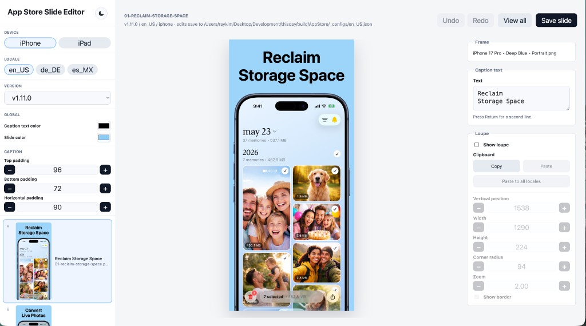
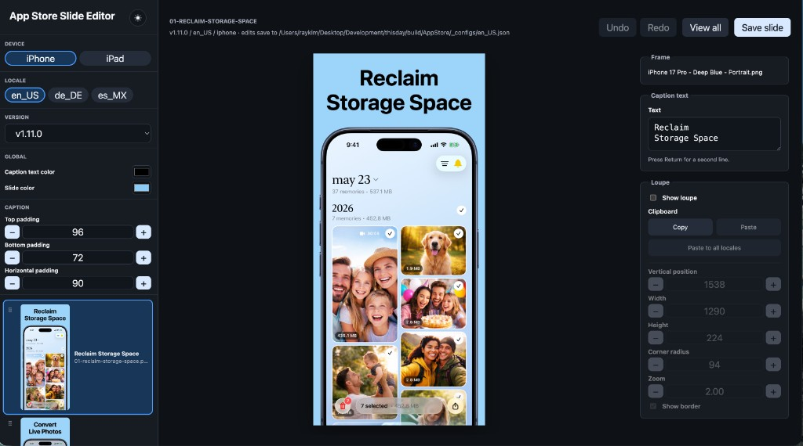
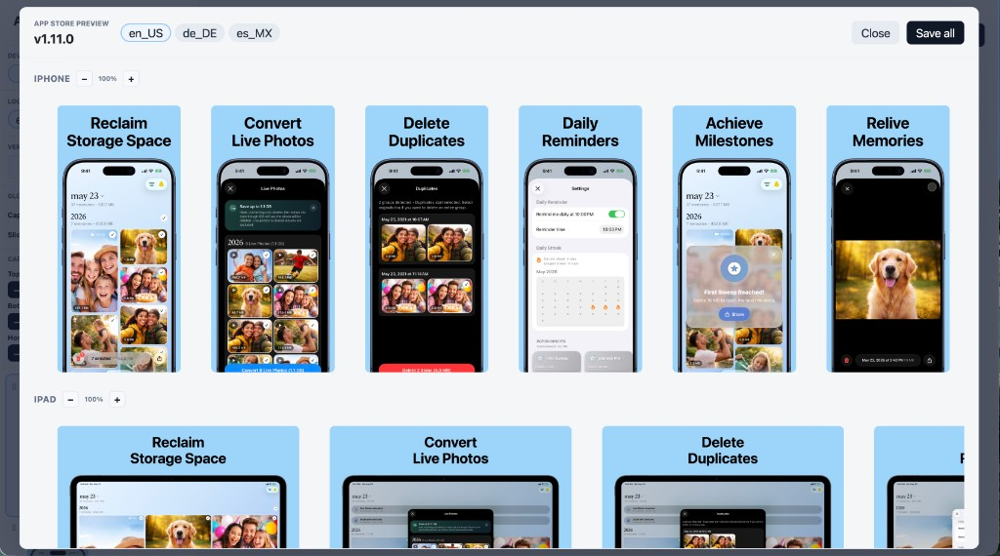

# app-store-slides-tool

JSON-driven tooling to render App Store screenshot slides for iPhone and iPad: device frames, captions, backgrounds, and optional loupe highlights. Point it at your app’s screenshot inputs and locale configs; outputs are App Store–sized PNGs ready for upload.

You’re welcome to use and adapt this for your own App Store screenshot workflow. No support guarantees.

## Requirements

- macOS 13 or later
- [Swift](https://www.swift.org/) 5.10+ (for the CLI renderer)
- [Node.js](https://nodejs.org/) (for the local browser editor)

## Quick start

From this repo:

```sh
swift build
swift run app-store-slides-tool --list-specs
```

Render slides from a JSON config (paths are yours—see **Configuration**):

```sh
swift run app-store-slides-tool \
  --config /path/to/your-app/build/AppStore/_configs/en_US.json \
  --device iphone \
  --locale en_US
```

For faster rerenders after config-only edits:

```sh
Scripts/render.sh --config /path/to/config.json --device iphone --locale en_US
Scripts/render.sh --config /path/to/config.json --device ipad --locale en_US
```

Rendered slides are written to the `outputRoot` path in the config, for example:

```text
/path/to/your-app/build/AppStore/v1.11.0/iphone/en_US/
```

## What it renders

- App Store-valid iPhone 6.9-inch canvases: `1290x2796` or `1320x2868`
- App Store-valid iPad 13-inch canvases: `2048x2732` or `2064x2752`
- Per-device frame images and screen rectangles
- Solid background colors
- Per-slide captions, localized by locale code
- Per-slide screenshot inputs

## Visual Editor

The local browser editor supports light and dark mode, per-slide editing, and a full **View all** gallery for reviewing every iPhone and iPad slide across locales.

### Slide editor (light mode)



Device, locale, and version selectors sit in the left sidebar with global color controls (caption text color, slide color), caption padding steppers, and slide navigation. The center shows a live preview; the right panel edits the selected slide (caption, frame, loupe, clipboard, layout).

### Slide editor (dark mode)



Same layout as light mode with a system-style dark theme. Use the ◐ control in the sidebar header to toggle themes.

### App Store preview gallery



**View all** opens a full-set preview for the selected version: iPhone and iPad slides in one place, with locale tabs, zoom controls, and **Save all** to persist changes across the matrix.

**Maintaining the screenshots:** Replace `docs/editor-ui-light.png`, `docs/editor-ui-dark.png`, and `docs/editor-gallery.png` when the editor UI changes in a meaningful way (new panels, major layout shifts, or after several smaller UX tweaks have accumulated). Keep `docs/editor-ui.png` in sync with the light-mode capture for any older links. Capture from the running editor at a typical working size so the README stays representative.

Start the editor with your app’s config directory and slide output root:

```sh
Scripts/editor.sh \
  --config-dir /path/to/your-app/build/AppStore/_configs \
  --slides-root /path/to/your-app/build/AppStore \
  --version v1.11.0 \
  --device iphone \
  --locale en_US \
  --no-render \
  --port 4321
```

Then open:

```text
http://127.0.0.1:4321/?device=iphone&version=v1.11.0&locale=en_US
```

The editor renders the current slide set on startup (use `--no-render` to skip when PNGs are already on disk), lets you pick a slide, change caption padding and loupe settings, and save. **Caption text color**, **slide color**, and **caption padding** in the sidebar apply across every slide and locale. Slide reordering also applies across every locale config. Loupe settings can be copied and pasted across slides (same device type); use **Paste to all locales** to apply the current slide’s loupe to that slide ID in every locale config. Saving updates the locale config JSON and rerenders the output PNGs for the selected editor version.

Generated folders are editable when the selected images belong to one of the loaded configs' current `version`, device, output root, and locale. Other discovered folders are shown read-only.

## Validate Without Rendering

```sh
swift run app-store-slides-tool \
  --config /path/to/config.json \
  --device iphone \
  --locale en_US \
  --validate-only
```

## Configuration

Pass a JSON config with `--config` (single file) or `--config-dir` (editor: one JSON per locale).

At the top level, configure:

- `name`: app name
- `version`: app/version label used in output paths, for example `v1.10.0`
- `outputRoot`: app-specific output folder

Generated slides are written as:

```text
<outputRoot>/<Version>/<Device>/<Locale>/
```

Frame assets live under `Assets/Frames/` in this repo.
