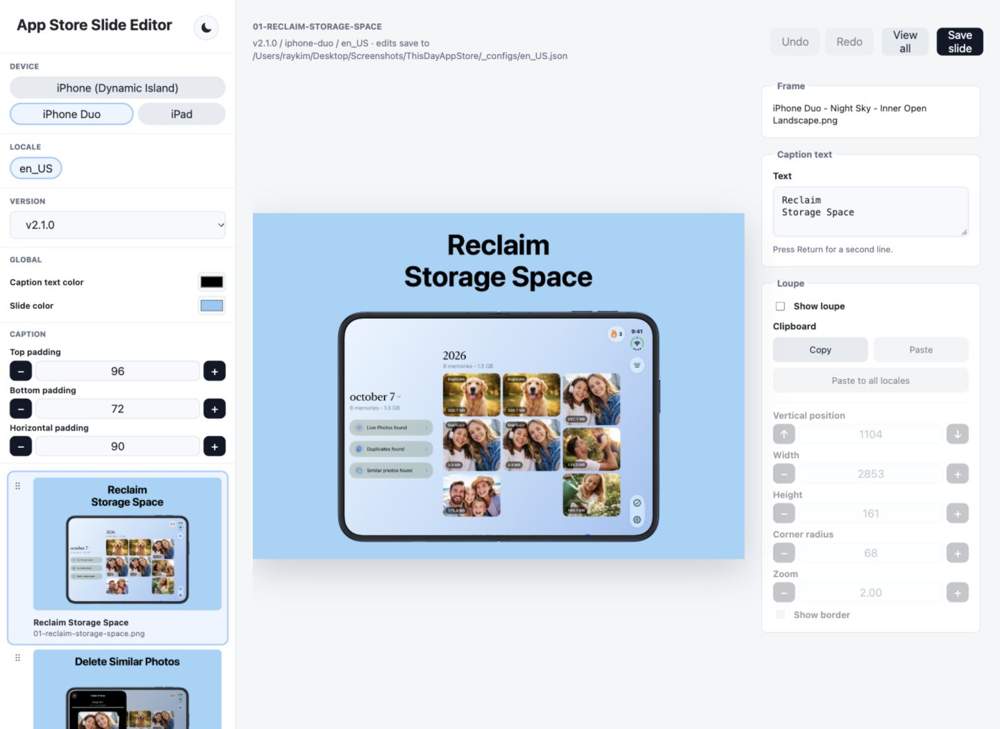
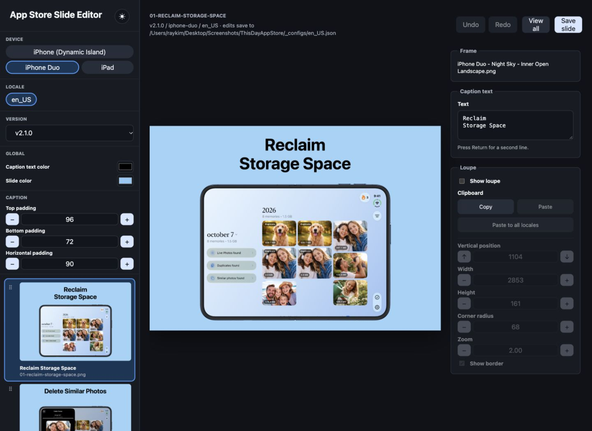
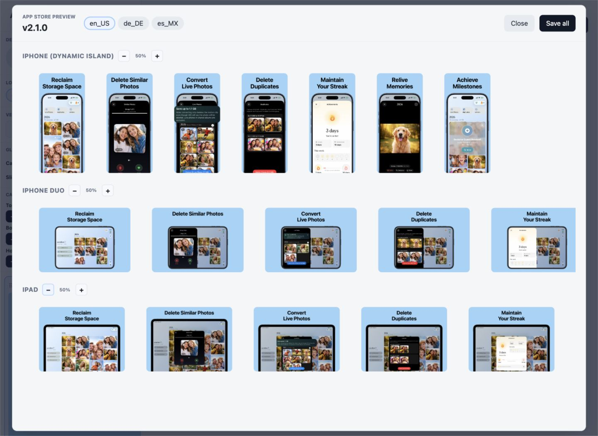

# app-store-slides-tool

JSON-driven tooling to render App Store screenshot slides for iPhone (Dynamic Island), iPhone Duo, and iPad: device frames, captions, backgrounds, and optional loupe highlights. Point it at your app’s screenshot inputs and locale configs; outputs are App Store–sized PNGs ready for upload.

You’re welcome to use and adapt this for your own App Store screenshot workflow. No support guarantees.

## Requirements

- macOS 13 or later
- [Swift](https://www.swift.org/) 5.10+ (for the CLI renderer)
- [Node.js](https://nodejs.org/) (for the local browser editor)

## Quick start

From this repo:

```sh
swift build
swift run app-store-slides-tool --list-specs
```

Render slides from a JSON config (paths are yours—see **Configuration**):

```sh
swift run app-store-slides-tool \
  --config /path/to/your-app/build/AppStore/_configs/en_US.json \
  --device iphone \
  --locale en_US
```

For faster rerenders after config-only edits:

```sh
Scripts/render.sh --config /path/to/config.json --device iphone --locale en_US
Scripts/render.sh --config /path/to/config.json --device ipad --locale en_US
```

Rendered slides are written to the `outputRoot` path in the config, for example:

```text
/path/to/your-app/build/AppStore/v1.11.0/iphone/en_US/
```

## What it renders

- App Store-valid iPhone 6.9-inch canvases: `1290x2796` or `1320x2868`
- App Store-valid iPhone Duo canvases: `1398x2034` / `2034x1398` (outer display), `2007x2853` / `2853x2007` (inner display)
- Opaque RGB PNG exports, with no alpha channel, as required by App Store Connect
- App Store-valid iPad 13-inch canvases: `2048x2732` or `2064x2752`
- Per-device frame images and screen rectangles
- Solid background colors
- Per-slide captions, localized by locale code
- Per-slide screenshot inputs

## Visual Editor

The local browser editor supports light and dark mode, per-slide editing, and a full **View all** gallery for reviewing every iPhone (Dynamic Island), iPhone Duo, and iPad slide across locales.

### Slide editor (light mode)



Device, locale, and version selectors sit in the left sidebar with global color controls (caption text color, slide color), caption padding steppers, and slide navigation. The center shows a live preview; the right panel edits the selected slide (caption, frame, loupe, clipboard, layout).

### Slide editor (dark mode)



Same layout as light mode with a system-style dark theme. Use the ◐ control in the sidebar header to toggle themes.

### App Store preview gallery



**View all** opens a full-set preview for the selected version: iPhone (Dynamic Island), iPhone Duo, and iPad slides in one place, with locale tabs, zoom controls, and **Save all** to persist changes across the matrix.

**Maintaining the screenshots:** Replace `docs/editor-ui-duo-light.jpg`, `docs/editor-ui-duo-dark.jpg`, and `docs/editor-gallery-duo.jpg` when the editor UI changes in a meaningful way (new panels, major layout shifts, or after several smaller UX tweaks have accumulated). Keep older captures for reference when updating these images. Capture from the running editor at a typical working size so the README stays representative.

Start the editor with your app’s config directory and slide output root:

```sh
Scripts/editor.sh \
  --config-dir /path/to/your-app/build/AppStore/_configs \
  --slides-root /path/to/your-app/build/AppStore \
  --version v1.11.0 \
  --device iphone \
  --locale en_US \
  --no-render \
  --port 4321
```

Then open:

```text
http://127.0.0.1:4321/?device=iphone&version=v1.11.0&locale=en_US
```

The editor renders the current slide set on startup (use `--no-render` to skip when PNGs are already on disk), lets you pick a slide, change caption padding and loupe settings, and save. **Caption text color**, **slide color**, and **caption padding** in the sidebar apply across every slide and locale. Slide reordering also applies across every locale config. Loupe settings are stored per slide and per device, so editing an iPhone loupe does not change the iPad loupe for that slide. Loupe settings can be copied and pasted across slides on the same device type; use **Paste to all locales** to apply the current slide’s loupe to that slide ID in every locale config for the active device. Saving updates the locale config JSON and rerenders the output PNGs for the selected editor version.

Generated folders are editable when the selected images belong to one of the loaded configs' current `version`, device, output root, and locale. Other discovered folders are shown read-only.

## Validate Without Rendering

```sh
swift run app-store-slides-tool \
  --config /path/to/config.json \
  --device iphone \
  --locale en_US \
  --validate-only
```

## Configuration

Pass a JSON config with `--config` (single file) or `--config-dir` (editor: one JSON per locale).

At the top level, configure:

- `name`: app name
- `version`: app/version label used in output paths, for example `v1.10.0`
- `outputRoot`: app-specific output folder

Generated slides are written as:

```text
<outputRoot>/<Version>/<Device>/<Locale>/
```

Frame assets live under `Assets/Frames/` in this repo.

## iPhone Duo

The editor has three device types: **iPhone (Dynamic Island)** (`iphone`, the existing config key), **iPhone Duo** (`iphone-duo`), and **iPad** (`ipad`). Existing iPhone/iPad configs continue to work; add a `devices["iphone-duo"]` entry and render its slides to enable the Duo tab for your app. Unavailable device tabs stay visible but disabled. The gallery provides a separate Duo row and zoom controls, and Duo loupe settings use its own canvas dimensions.

Apple's [App Store screenshot specifications](https://developer.apple.com/help/app-store-connect/reference/app-information/screenshot-specifications/) and `asc screenshots sizes --all` list four accepted Duo sizes. Use `appStorePreset: "iphone-duo"` for either display in either orientation. The App Store inner-display export dimensions differ from the hardware resolution on the [technical specifications page](https://www.apple.com/iphone-duo/specs/); use the App Store dimensions for the slide canvas.

Capture the app on the selected Duo display and match its orientation to the frame. The renderer checks the source aspect ratio so a regular iPhone screenshot cannot silently stretch into a Duo bezel. Changing the preset alone does not make an app capture a Duo screenshot.

For **Inner Open Landscape**, explicitly select the inner display, landscape orientation, and a fully open **180° hinge angle** in Device Hub before capturing. Keep that pose for every slide. A partially folded inner display produces the same pixel dimensions, so the renderer's aspect-ratio check and App Store validation cannot detect the wrong pose. Verify the native UI and save a Device Hub pose reference with the capture evidence before rendering. Standard sheets should be centered in the fully open inner display; sheets shifted to one side can indicate fold avoidance. See Apple's [sheet and fold-avoidance guidance](https://developer.apple.com/videos/play/tech-talks/111466/?time=516).

The tool uses local Night Sky frames from [Apple Design Resources](https://developer.apple.com/design/resources/). Download the **iPhone Duo bezels** from Apple, accept their license, and open the downloaded disk image. Import from its mounted folder:

```sh
node Scripts/import-duo-frames.js --source '/Volumes/<mounted Duo bezel folder>'
```

The helper imports the four required PNGs and their license into `Assets/Frames/`. These licensed source assets are ignored by Git and are not redistributed in this repository. Apple's license restricts their use to mock-ups for software that runs only on Apple operating systems; recipients of rendered mock-ups must follow the license, including its restriction on extracting the template content. Read the imported license before using the resources.

Their screen rectangles (in frame pixels, measured from the top left) are:

| Frame | Screen x, y | Screen width × height |
| --- | --- | --- |
| Inner Open Landscape | 120, 120 | 2853 × 2007 |
| Inner Open Portrait | 120, 120 | 2007 × 2853 |
| Outer Closed Landscape | 80, 88 | 2034 × 1398 |
| Outer Closed Portrait | 88, 80 | 1398 × 2034 |

See your local `Assets/Frames/Apple-Design-Resources-License.rtf` for Apple's resource license.

Add the device to an existing config while preserving its other devices and slides:

```sh
node Scripts/add-duo-device.js --config /path/to/config.json --screenshot-root /path/to/duo/en_US/raw --display inner --orientation landscape
```

The helper fits the official frame beneath the existing caption layout. Adding a device does not copy another device's loupe settings; configure the Duo loupe in the editor after rendering.

Duo supports the same locales as the other device types. For one config per locale, add it to the whole config directory in one command. `{locale}` is replaced with each config's `defaultLocale`; it is required in directory mode to keep localized screenshot inputs separate. Existing translations, devices, and loupe settings are preserved.

```sh
node Scripts/add-duo-device.js --config-dir /path/to/_configs --screenshot-root '/path/to/duo/{locale}/raw' --display inner --orientation landscape
```

Capture the app in each locale and render each config using its own locale code. Adding a config does not create or translate screenshots. The editor shows the version's locale matrix for each device; locales without generated slides are disabled and labeled **(N/A)** until their output is ready.

Equivalent example addition (inner display, landscape):

```json
"iphone-duo": {
  "appStorePreset": "iphone-duo",
  "canvas": { "width": 2853, "height": 2007 },
  "screenshotRoot": "/path/to/duo/en_US/raw",
  "frame": {
    "image": "/path/to/app-store-slides-tool/Assets/Frames/iPhone Duo - Night Sky - Inner Open Landscape.png",
    "screen": { "x": 120, "y": 120, "width": 2853, "height": 2007 },
    "screenCornerRadius": 166,
    "scale": 0.64,
    "top": 520
  }
}
```

Tune frame scale/top for your captions, then render and validate:

```sh
Scripts/render.sh --config /path/to/config.json --device iphone-duo --locale en_US
asc screenshots validate --path /path/to/output/iphone-duo/en_US --device-type APP_IPHONE_DUO --output table
```

To change display/orientation, replace the canvas, frame image, screen rectangle, and input captures together. Keep the device key `iphone-duo` so it stays one of the three device types. `--device all` renders every device configured for the app.

Regression checks:

```sh
node Scripts/test-editor-loupes.js
node Scripts/test-duo.js
node Scripts/test-duo-locales.js
node Scripts/test-duo-frame-import.js
```
